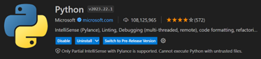
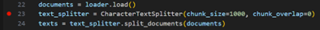
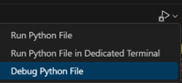

**Debugging standards and best practices** {#debugging-standards-and-best-practices .TOC-Heading}
==========================================

** Guidebook** {#guidebook .TOC-Heading}
==============

  -------------------- ----------------
                       
                       
                       
                       
                       
                       
                       
                       
                       
                       
                       
                       
  **Creation date:**   04.01.2024
  **Version 1.0:**     04.01.2024
  **Author:**          Andrej Cepygin
  -------------------- ----------------

**Contents** {#contents .TOC-Heading}
============

[1 Scope 3](#scope)

[1.1 Document Overview 3](#document-overview)

[1.2 Abbreviations 3](#abbreviations)

[1.3 Revisions 3](#revisions)

[2 Kinds of errors 4](#kinds-of-errors)

[2.1 Syntax errors 4](#syntax-errors)

[2.2 Runtime errors 4](#runtime-errors)

[2.3 Logic errors 4](#logic-errors)

[3 Literatur 4](#literatur)

Scope {#scope .Akkodis-Überschrift-1}
=====

This document explains briefly the common errors that can occur during
coding and provides some debugging standards.

Document Overview {#document-overview .Akkodis-Überschrift-2}
-----------------

-   Kinds of errors

-   Debugging with IDEs

-   Debugging C++ with GNU Debugger (GDB)

Abbreviations {#abbreviations .Akkodis-Überschrift-2}
-------------

This section contains a table of abbreviations utilized throughout this
document, along with their corresponding meanings. They are organized in
alphabetical order for ease of reference.

  IDE       Integrated Development Environment
  --------- ------------------------------------
  VS Code   Visual Studio Code

Revisions {#revisions .Akkodis-Überschrift-2}
---------

  **Rev**   **Actions**   **Comment**
  --------- ------------- -------------
  \-        First Issue   
                          

Kinds of errors {#kinds-of-errors .Akkodis-Überschrift-1}
===============

There are mainly 3 kinds of errors when writing code or programs, which
are different and fall in the following categories:

Syntax errors {#syntax-errors .Akkodis-Überschrift-2}
-------------

Syntax errors are mistakes in the source code such as misspelling,
punctual error or incorrect labels, which cause an error message to be
generated by the compiler. Those error messages appear in a separate
error window on the IDE with the error type in the line number. IDEs
have syntax highlighting that helps reducing syntax errors while coding
and provide clear error messages or suggestions to help fix the issue.

Runtime errors {#runtime-errors .Akkodis-Überschrift-2}
--------------

Runtime errors happen when the programming language doesn't understand
the instructions in the code. A program with a runtime error passed
syntax checks and started to execute. The error occurred during
execution of a statement in the program is displayed as an error
message. Runtime error are called exceptions and would be:

-   Misspelled variable names

-   Operations on data of wrong types

-   Diving by zero

-   Type conversion on a value that can't be converted to that type

Logic errors {#logic-errors .Akkodis-Überschrift-2}
------------

When the script or program compiles and run fine but doesn't operate as
intended is called a logic error. They occur by mistake in reasoning by
the programmer. Logic errors do not result in error codes.

Debugging with IDEs {#debugging-with-ides .Akkodis-Überschrift-1}
===================

As stated previously, syntax errors are automatically highlighted by
your IDE and logical errors can only be resolved by the programmer
themselves. To fix runtime errors you often need to step through each
line of code while its executing to understand where the code breaks.
For this you need a tool called debugger.
[Here](https://www.shakebugs.com/blog/app-debugging-methods/) are some
debugging methods that might help for a more efficient debugging.
Following are the common cases for debugging:

Debugging Python {#debugging-python .Akkodis-Überschrift-2}
----------------

PyCharm already comes with a debugger when
you download the program and the python version. In vs Code you need to
install the python extension as well:

Then you can set a breakpoint at a line
where you want the debugger to pause the execution of the code:

And start the debugger:

The debugger is now giving you a list of all variable states and you can
check the code line by line for the cause of the exception.

Debugging C++ {#debugging-c .Akkodis-Überschrift-2}
-------------

VS Code provides a debugging plugin for C++, which can be used like the
python debugging tool explained in the section above. The VS Code plugin
page provides a guide for the extension for the compilers MSVC, Clang
and GCC. If the program is written with the GNU compiler and the -g tag,
GDB can be used as a C++ debugger.

Debugging C++ with GDB {#debugging-c-with-gdb .Akkodis-Überschrift-1}
======================

The following is an abbreviation of the [BitDegree
Tutorial](https://www.bitdegree.org/learn/gdb-debugger/amp) on how to
use the C++ GDB Debugger:

### Preparing the DGB debugger for use  {#preparing-the-dgb-debugger-for-use .Akkodis-Überschrift-3}

Compile the C++ code with the -g flag:

\$ g++ - g filename.cpp

Call the GDB to start the debugging process for the program you wish to
analyze:

\$ gdb program\_name

Run the program with one of the following examples:

\$ (gdb) run

You can pass arguments if the program needs some command-line arguments
to be passed to it:

\$ (gdb) run arg1 arg2

Debugging with GDB lets you investigate the core file as well. The core
file contains information about when a program crashed:

\$ (gdb) core filename

### Setting breakpoints {#setting-breakpoints .Akkodis-Überschrift-3}

The following example sets a breakpoint at the start of the main
function:

\$ (gdb) b main

This example sets a breakpoint at a specific line (20):

\$ (gdb) b 20

This example adds a breakpoint at the beginning of a class member
function:

\$ (gdb) b list::erase

This example lists all the breakpoints:

\$ (gdb) info b

The following example deletes a breakpoint at line 20:

\$ (gdb) delete 20

### Running the program slowly {#running-the-program-slowly .Akkodis-Überschrift-3}

next: executes the current command, stops, and displays the next
function in line for execution.

\$ (gdb) next

step: executes the current command. In cases when it is a function call,
it breaks at the beginning of that method.

\$ (gdb) step

### Printing values of variables  {#printing-values-of-variables .Akkodis-Überschrift-3}

The GDB debugger can check the values of variables during specific
moments of the execution with the print command.

\$ (gdb) print \<expression\>

Literatur  {#literatur .Akkodis-Überschrift-1}
=========

<https://blog.devgenius.io/how-to-debug-code-best-practices-tips-tricks-633c941159d7>

<https://www.shakebugs.com/blog/app-debugging-methods/>

[Tutorial on How to Use the GDB Debugger Easily
(bitdegree.org)](https://www.bitdegree.org/learn/gdb-debugger/amp)

[gdbassem.pdf
(princeton.edu)](https://www.cs.princeton.edu/courses/archive/spr17/cos217/precepts/15assemlang/gdbassem.pdf)
